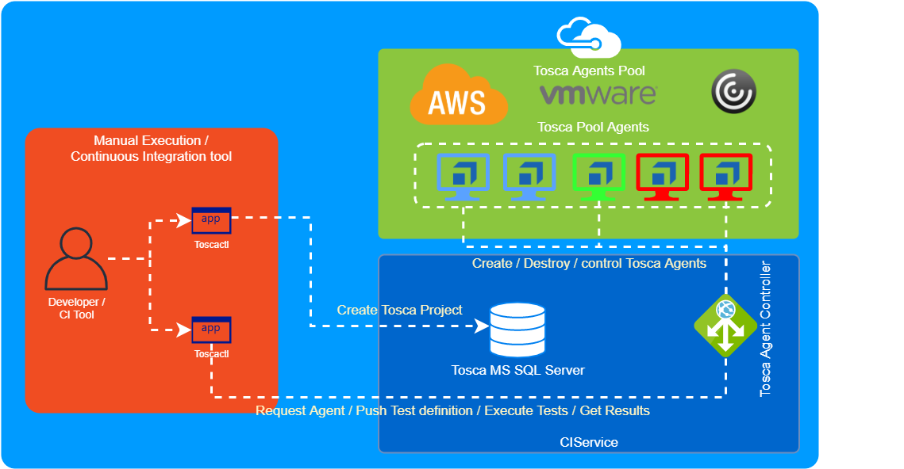

# toscaci
Tosca cli tool and a rest API service that improve interaction of CI Tools with Tosca in a clean and escalable way.

[](https://github.com/segator/toscaci/actions/workflows/build.yml)

## Table of content
- [History](#History)
- [Features](#Features)
- [Requirements](#Requirements)
- [Architecture](#Architecture)
- [Getting started](#Getting-started)
  - [CLI tool](#Using-CLI-tool)
  - [CIService](#Configure-CIService)
- Development
  - [CLI tool](./client/README.md)
  - [CIService](./server/Readme.md)


## History
if you tried to integrate Tosca on a modern CI enterprise platform you will notice lot of limitations on how Tosca can be integrated, some of the issues:
- No easy way to create Projects via cli or api.
- Test definitions are keep on a DB, so dificult portability of the tosca projects
- No support for test runtime parameters like url of application under test
- No git friendly
- Tosca concurrency model and locking system causes CI fails if users forgot to check in tosca project.
- Tosca VM Agent pinned with User Project, hard test infrastructure resources escalability.

This project has been created to fix all this issues and make the integration with your Continuous Integration pipelines as easy as possible.

## Features
- [x] Inject runtime parameters to tosca, no need to define test parameters on tosca test definition, just use a config parameter on tosca.
- [x] Execute multiple execution list based on filtering by tosca object properties
- [x] Execute tests from files (subset/project definition) or from connection string
- [ ] Select free tosca executor to run the test
- [x] Generate Junit file from test results
- [x] Generate Tosca Reports
- [x] Get all the artifacts generated on the test process   

## Requirements
- Tosca Commander 13.1 installed

## Architecture
This product is based in three components
* Windows Rest API Service (CIService)
* Tosca Commander Addon
* Multiplatform CLI Tool (toscactl)





## Getting started
To be able to use this tool you first need to understand how to use the toscactl and configure the CIService

## Using CLI tool
Get the cli tool from https://github.com/Boehringer-Ingelheim/toscaci/releases

### tosca-suite file configuration
A test suite is defined creating a file with the given format: ```tosca-<suiteName>.json```
```
{
  "agent": {
    "hostname": "http://toscaCIServiceURL:8080"
  },
  "testSuite": {
    "parameters": {      
        "myParam":"myValue",
        "myParam2":"myValue"
    },
    "selectors": {
      "TestType": "installation",
      "TestBranch": "master"
    },
    "reports": [ "ToscaIntegrationReport","myOtherReport" ]
  }
}
```
| property | value | description |
|---|---|---|
| agent.hostname  | http://url:8080  |  this parameter indicates to which tosca ciservice node tests will be executed |
| testSuite.parameters | "myparam":"myvalue"  | you can inject runtime parameters that will be seen as config parameters in tosca, typical usage is for URL of application under test. |
| testSuite.selectors | "mySelector":"myValue" | you can filter which execution lists will be triggered as part of your testSuite execution |
| testSuite.reports | "myToscaReport" | Name of the tosca report design to execute to render a report in PDF |


### toscactl test run action

```
Usage:
  toscactl run [agent selectors] [suite selector] [suite parameters] [testSuite] [flags]

Flags:
      --agent-hostname string       Tosca Agent where to run the test execution
      --agent-selector key=value    Tosca Agent where to run the test execution
      --from-connection string      Create Workspace from existing Tosca MSSQL Database
      --from-path string            Create Workspace from file definition (Workspace definition (.tpr) and subset (.tsu) are needed in the path (default "src/tosca")
  -h, --help                        Help for run
      --suite-parameter key=value   Runtime Test parameter to inject on your Execution List
      --suite-report name           Tosca Reports Name to generate after test execution
      --suite-selector key=value    Select Execution Lists  to run by properties

Global Flags:
      --config string            config file path, accept Environment Variable TOSCA_CONFIG (default is $HOME/.tosca-config.yaml)
  -s, --orchestratorURL string   Tosca Orchestrator URL (default "http://localhost:8080")
      --password string          Tosca Server password
      --username string          Tosca Server username
  -v, --verbose                  verbose output
  -w, --workingDir string        Working Directory where entities and results are expected
```

an example could be ```toscactl run --suite-parameter URL=http://google.com acceptance```


## Configure CIService
To install CIService you need to do next actions:
1. Get the CIService from from https://github.com/Boehringer-Ingelheim/toscaci/releases files ```toscaci-service-windows-amd64.zip``` and ```toscacommander-addon-windows-amd64.zip```
2. unzip ```toscacommander-addon-windows-amd64.zip``` on ```C:\Program Files (x86)\TRICENTIS\Tosca Testsuite\ToscaCommander```
3. unzip ```toscaci-service-windows-amd64.zip``` in your prefered place
4. open unziped folder and run CIService.exe

5. if you want the application runs on  windows bootup we recommend to create a windows schedule task that execute the application on boot
6. Also enable a windows user autologon on boot

Unfortunatelly tosca requires full UI interaction so the application can not run as Windows service.